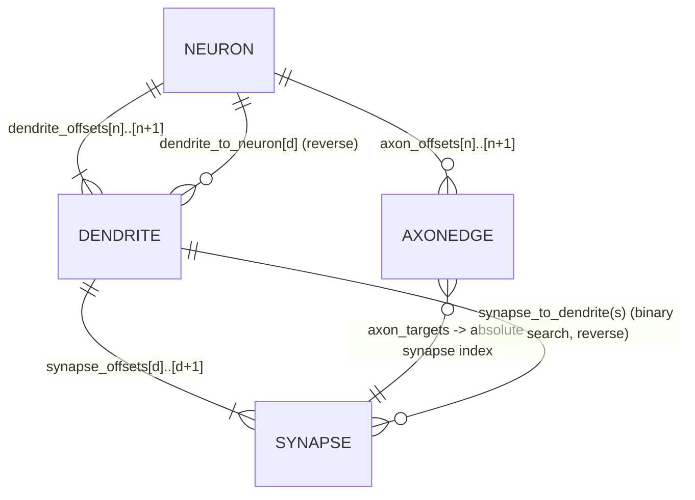
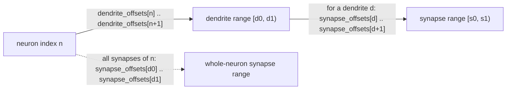
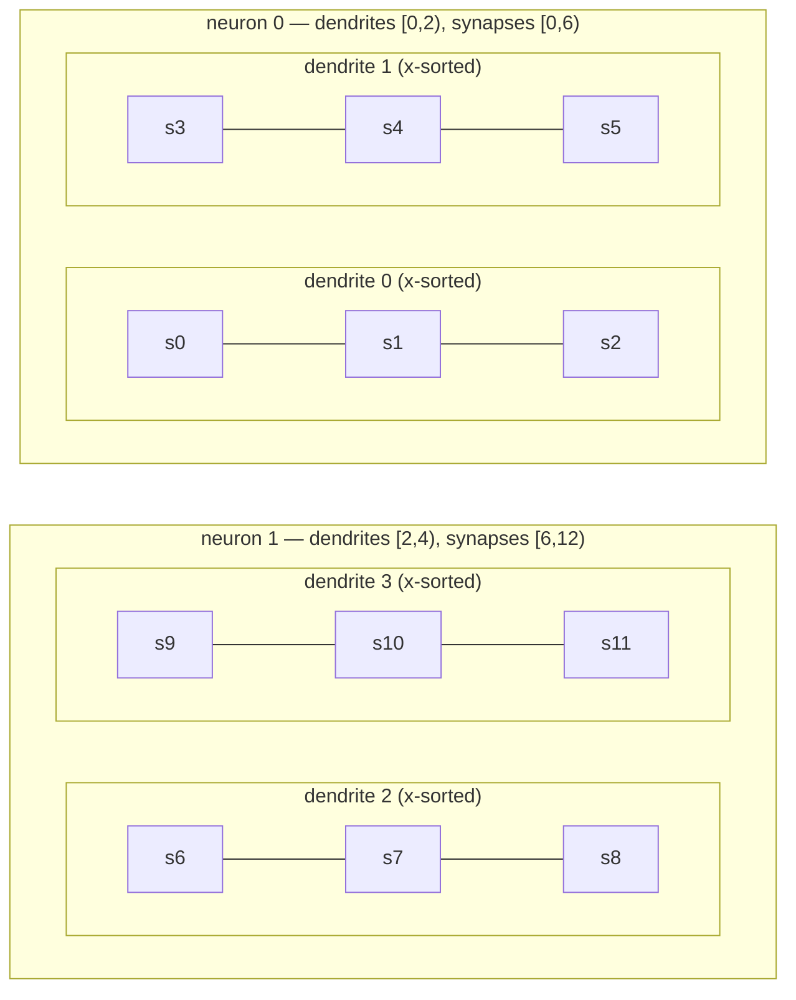
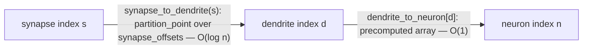

# Resource — How components relate through indices

A visual companion to [chapter 3 (Data model)](../03-data-model.md) and
[chapter 5 (Event system)](../05-event-system.md). It answers one question: given
the flat SoA arrays, how does any component find the others it is related to,
using only integer indices and the offset arrays?

## The one invariant that makes everything work

The global **synapse array is ordered by `(neuron, dendrite, x)`**:

- A neuron owns a *contiguous* run of dendrites.
- A dendrite owns a *contiguous* run of synapses.
- Within a dendrite, synapses are sorted ascending by position `x`.

So the synapse array, front to back, is: neuron 0 / dendrite 0 (x-sorted),
neuron 0 / dendrite 1, …, neuron 1 / dendrite 0, … An absolute synapse index
therefore *implicitly* encodes which dendrite and which neuron own it — and that
is exactly why `axon_targets` can store a bare synapse index and nothing else.

## 1. The ownership model (high level)



Forward edges (top three) are **contiguous-range** lookups via offset arrays.
The bottom two are the **reverse** lookups the event loop needs.

## 2. The offset-array indirection (the CSR mechanic)

Every "owns" relationship is the same trick: an index into an *offsets* array
yields a `[start, end)` range into the *owned* array. The `+1` sentinel makes the
end free.



The dashed edge is `neuron_synapse_range` ([§3.2](../03-data-model.md)): it
composes both offset arrays to get *every* synapse a neuron owns in one range —
what `handle_somatic_spike` uses for the BaP-style weight update.

## 3. A concrete example

2 neurons · 2 dendrites each · stride 3 synapses per dendrite.

| Array | Values | Reading |
| ----- | ------ | ------- |
| `dendrite_offsets` | `[0, 2, 4]` | neuron 0 owns d`[0,2)`; neuron 1 owns d`[2,4)` |
| `synapse_offsets`  | `[0, 3, 6, 9, 12]` | d0→s`[0,3)`, d1→s`[3,6)`, d2→s`[6,9)`, d3→s`[9,12)` |
| `dendrite_to_neuron` | `[0, 0, 1, 1]` | reverse map d→n |

Containment and global ordering (no edges — just the nesting and the contiguous
index runs):



With fixed slots ([§7.3](../07-network-construction.md)), `synapse_offsets`
becomes analytic — `synapse_offsets[d] = d * 3` — and `synapse_to_dendrite(s)`
collapses to `s / 3`. No stored offsets array, no binary search.

## 4. The forward (axon) path through indices

Now neuron 0 fires and projects to synapse `s7` (on dendrite 2) and `s10` (on
dendrite 3) — both owned by **neuron 1**. The axon CSR encodes this:

| Array | Values | Reading |
| ----- | ------ | ------- |
| `axon_offsets` | `[0, 2, 2]` | neuron 0 → targets `[0,2)`; neuron 1 → `[2,2)` (none) |
| `axon_targets` | `[7, 10]` | the absolute synapse indices neuron 0 drives |

```mermaid
flowchart LR
    soma0(("soma 0 spikes")) -->|"emit FORWARD_AP, source = 0"| loop{{"event loop: FORWARD_AP arm"}}
    loop -->|"axon_targets[ axon_offsets[0] .. axon_offsets[1] ] = [7, 10]"| t7["target s7"]
    loop --> t10["target s10"]

    t7 -->|"synapse_to_dendrite(7) = 2"| d2["dendrite 2"]
    t10 -->|"synapse_to_dendrite(10) = 3"| d3["dendrite 3"]

    d2 -->|"dendrite_to_neuron[2] = 1"| n1soma(("soma 1"))
    d3 -->|"dendrite_to_neuron[3] = 1"| n1soma

    t7 -. "handle_forward_ap: boost alpha, gamma-integrate" .-> d2
    t10 -. .-> d3
    d2 -. "if activity >= threshold: DENDRITIC_SPIKE" .-> n1soma
```

Trace it in words: soma 0 spikes → emits `FORWARD_AP(source=0)` → the loop reads
`axon_targets` for neuron 0 → lands on absolute synapses `s7`, `s10` → each is
resolved to its dendrite (`synapse_to_dendrite`) → `handle_forward_ap` boosts
that synapse and integrates its dendrite → if a dendrite crosses threshold it
emits a `DENDRITIC_SPIKE`, whose handler finds the soma via
`dendrite_to_neuron`. The forward signal crossed from neuron 0 to neuron 1 using
nothing but integer indices.

## 5. The two reverse lookups, side by side



`dendrite_to_neuron` is stored (cheap O(1), built at allocation) because the
`DENDRITIC_SPIKE` handler needs it on every dendritic spike;
`synapse_to_dendrite` is a binary search because it is only needed when fanning
out a forward AP and storing a full per-synapse reverse map would cost more than
it saves (and becomes pure division under fixed slots anyway).

---

See also: [§3.1 component arrays](../03-data-model.md),
[§3.2 index hierarchy](../03-data-model.md),
[§5.3 dispatch loop](../05-event-system.md),
[§7.3 fixed slots](../07-network-construction.md).
